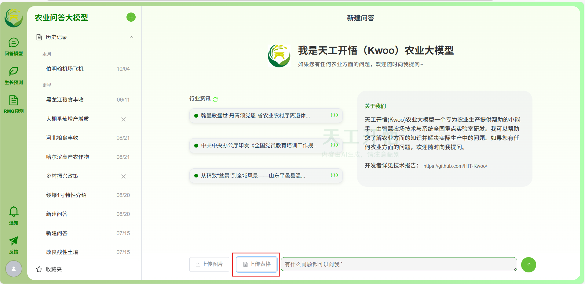
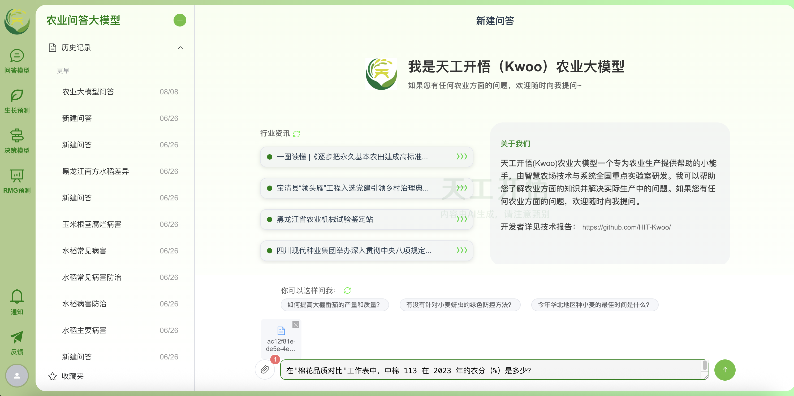
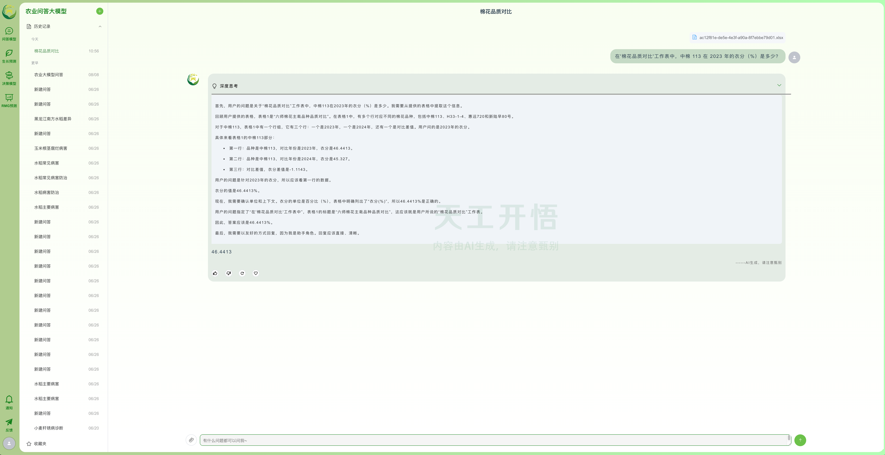

# 🗃️ KwooLa‑TableQA 组件（表格问答）

> 让大模型读懂你的表格，用自然语言完成分析与问答。

[🌟 前往 KwooLa 主仓库](https://github.com/HIT-Kwoo/KwooLa/tree/main)

---

## 🚀 项目概述

KwooLa‑TableQA 基于「天工开悟」大模型体系，增强对 **CSV / XLS / XLSX** 等电子表格的理解和推理能力，让你**上传表格 → 直接提问 → 获得答案**。

我们提出了结合 **知识蒸馏** 与 **强化学习** 的训练框架：

- 📚 **数据构建**：收集数十个开源表格数据集（合计 **22w+**），基于 _Qwen3‑Next‑80B‑A3B‑Thinking_ 通过 **拒绝采样蒸馏** 得到 **21w+** 高质量、**长思维链** 表格问答数据。
- 🧠 **训练范式**：先用 **监督微调（SFT）** 初始化，再用 **GRPO** 算法进行强化学习，显著提升推理与问答的稳健性。
- 📈 **评测结果**：在 **中文 AIT‑QA** 数据集上正确率 **95%+**（持续优化中）。

---

## ✨ 功能特性

- 🔍 **结构感知**：自动解析表头、合并单元格、数值/文本列、日期等类型与关系。
- 🧩 **多步推理**：支持跨列运算、条件筛选、排序聚合与链式计算。
- 💬 **自然语言交互**：用中文直接问问题，得到透明、可解释的回答。
- 📎 **多格式兼容**：原生支持 **CSV / XLS / XLSX**。
- 🪶 **轻集成**：可作为组件接入你的应用，前后端均易用。

---

## ▶️ 快速体验（以天工开悟网页版为例）

**1）📂 上传表格**
准备一个 `CSV`、`XLS` 或 `XLSX` 文件，点击 **「上传表格」**。

> 建议先用项目内的 **`新疆棉花_脱敏.xlsx`** 做快速体验。

</img> 

**2）🗣️ 自然语言提问**
上传成功后，文件会显示在附件区域。直接在对话框里提出你的问题，例如：

- 「在'棉花品质对比'工作表中，中棉 113 在 2023 年的衣分（%）是多少？」
- 「在'棉花品种汇总'工作表里，惠远 720 的单铃重（g）是多少？」
- 「在'棉花品质对比'表中，H33 - 1 - 4 在 2024 年的断裂比强度（gf／tex）是多少？」

</img> 

**3）💡 获取智能回答**
系统会自动理解表格结构并进行多步推理，用清晰的自然语言给出结论与关键过程。

</img> 

---

## 🏗️ 设计要点（训练与数据）

- **知识蒸馏**：以 _Qwen3‑Next‑80B‑A3B‑Thinking_ 为教师模型，通过拒绝采样获取高质量思维链数据。
- **监督微调（SFT）**：用蒸馏数据进行初始化，奠定基本问答与格式对齐能力。
- **强化学习（GRPO）**：在表格场景持续优化策略，提升复杂推理与鲁棒性。

---

## ❓ 常见问题（FAQ）

**Q1：支持哪些文件格式？**
A：`CSV / XLS / XLSX` 均支持，建议尽量保持字段命名清晰、避免过度合并单元格。

**Q2：有表格大小限制吗？**
A：目前暂时限制所有表格文本内容总计不超过 3 万字，子表数量无明确限制。如遇大小限制，建议拆分表，在多个会话中分别提问。

**Q3：能处理多表关联吗？**
A：支持在同一工作簿内进行多表引用与对照；跨表逻辑建议在问题中明确描述关联键。

**Q4：隐私与合规如何保证？**
A：请在上传前进行脱敏（示例文件已脱敏）。生产环境中建议配合访问控制与脱敏流水线。
