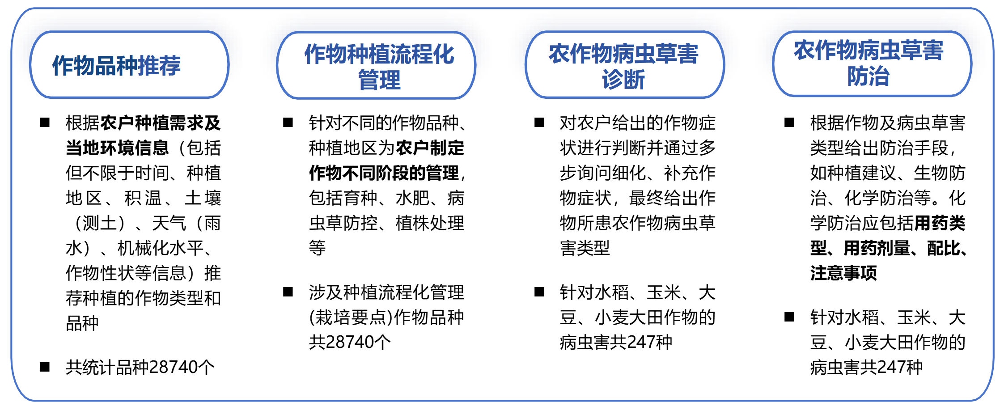
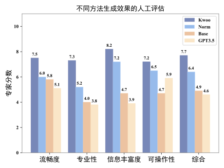

<div align="center">
</img> 
</div>

## 天工开悟-农业问答大模型(KwooLa)

> **天工不遗，以配万物；开悟不止，以成百谷。**

### :fire::fire:News

- [2025/10/23] :rocket::tada: **天工开悟 2.0 正式发布！** SQL 数据库对话、表格分析与深度思考能力现已正式上线，标志着 KwooLa 在结构化数据处理与复杂推理方面迈上新台阶。

- [2025/09/03] :card_file_box::chart_with_upwards_trend: **新增 SQL 数据库理解能力**，支持连接 SQL 数据库或上传 SQL 文件，通过自然语言完成复杂的查询、数据分析与报告生成。

- [2025/07/06] :bar_chart::file_folder: **新增表格理解能力**，模型新增对电子表格文件的理解能力，允许用户上传 CSV、XLS、XLSX 等格式文件，结合表格进行数据解析和智能问答。

- [2025/06/19] :brain::crystal_ball: **新增深度思考能力**，引入深度思考（Deep Thinking）模块，显著增强了模型在复杂问题上的逻辑推理和规划能力，模型综合能力进一步提升。

- [2025/04/09] :speech_balloon::globe_with_meridians: **上线多轮对话与联网检索功能**，模型现已支持多轮对话，能够更好地理解上下文语境；同时集成联网检索功能，确保信息获取的实时性与准确性，为用户提供更全面、更新的决策支持。

- [2025/03/20] :boom::boom: **推出了 OpenAI 兼容 API 调用方式**，开发者和企业用户可以轻松集成 KwooLa 到绝大多数平台。

- [2025/03/12] :iphone::rocket: **“天工开悟”iOS 应用正式上架 App Store**，iPhone 用户现在可以随时随地体验 KwooLa 的专业农业问答服务。 [点击下载](https://apps.apple.com/cn/app/%E5%A4%A9%E5%B7%A5%E5%BC%80%E6%82%9F/id6738081283)

- [2024/11/20] :boom::boom: **推出 API 访问方式并支持流式输出**，开发者和企业用户可以轻松集成 KwooLa 的强大功能，实现更高效、更实时的交互体验，全面赋能农业领域的智能化升级，助力打造多样化、定制化的智慧农业解决方案。

- [2024/11/20] :star2::star2: **更新了 KwooLa 的 APP 使用教程和测试用例**，让用户能够快速上手，充分体验 KwooLa 在农业生产中的高效性与便捷性，推动智能农业的普及和落地。

- [2024/11/02] :rose::rose: **发布了 KwooLa**，面向大田作物种植咨询、种植作物推荐、种植全流程管理、病虫草害诊断与防治等农事场景，能够为农业从业人员提供信息丰富、精准度高、可操作性强、农业知识对齐的决策指导！支持[Web 端](https://www.tgkwai.com/) 、Android 端 APP 访问(下载 APP 请点击[这里](#天工开悟app))。

### 天工开悟 APP

欢迎大家体验**天工开悟 APP** :sparkles::sparkles:。

- **Android 用户**：请扫描下方二维码下载安装，或[点击此处直接跳转](https://www.tgkwai.com/download.html)。
- **iOS 用户**：请在 App Store 中搜索“天工开悟”下载，或[点击此处直接跳转](https://apps.apple.com/cn/app/%E5%A4%A9%E5%B7%A5%E5%BC%80%E6%82%9F/id6738081283)。
- **Web 网页**：请访问https://www.tgkwai.com/，点击“开始使用”

使用方法：第一步，打开 APP，进入登录页面，勾选同意协议选项后使用手机号进行登录。第二步，登录后进入问答页面，在下方输入框中输入想要询问的问题，等待回答。

<div align="center"> </img> </img> </div>

### 模型简介

**天工开悟-农业问答大模型（KwooLa）** 集知识问答、农事决策指导、多轮对话、联网检索等功能于一体，致力于向大田作物作物品种推荐、种植全流程管理、病虫草害诊断与防治等真实的农事场景提供精准可靠、信息丰富、与农业基准一致、可操作的决策指导。

KwooLa 融合了**知识协同微调**及**混合检索增强**技术，实现了农业知识的隐式参数注入及生成显式约束。

#### :book:知识协同微调

为更好实现模型在训练过程中对农业专业 token 的关注，我们借鉴有监督微调（如 LoRA）以及 Focus Learning 提出知识协同微调。我们将标准回复的每个 token 与对应知识通过余弦相似度计算相关度，通过函数变换后得到每个位置的重要性，相关度越高的位置重要性越高。然后通过增大重要性高的位置的概率，从而增大这个位置对训练中损失的影响程度，最终达到提高模型对此位置关注度的效果。

#### :page_with_curl:混合检索增强

KwooLa 从多源知识库中进行混合检索增强，**融合了 BGE 密集检索及 BM25 稀疏检索**。**除本地知识库外，KwooLa 接入了在线检索功能**，有效利用专业书籍知识、广泛的网页知识为模型回复提供引文标注，实现知识可溯源。

:rice_scene:KwooLa 开放的版本以 Qwen2-7B-Chat 模型为 Base 模型，迁移了知识协同微调及混合检索增强。**KwooLa 国内首个成功备案的农业类大模型，为构建智慧农业大脑提供了助力。**天工开悟-农业问答大模型具有以下优势：

:one:在农业领域的回复更加细粒度，例如可以较为精准的给出病虫害防治方法及相关药物剂量和配比；

:two:具有一定的可解释性，可以针对问题给出具有相关知识作为引文的回复；

:three:信息量高，知识一致性高在知识引导下生成回复；

:four:流畅性好，可以针对农业问题生成更加合理的回复；

:five:可执行度大，可操作性强，基于农业问题给出的指导决策在一定程度上可直接进行实际应用，如品种推荐，种植流程管理；

:six:领域一致性强，农业数据及知识协同驱动，与农业领域的知识高度对齐，回复置信度高；

:seven:准确性高，与农业标准对照具有极高相似度。

### ✨ 核心能力

天工开悟（KwooLa）集成了多项前沿技术，提供以下核心能力，致力于打造一站式智慧农业解决方案：

- **🗃️ Text2SQL 与数据库对话**
  模型具备强大的 SQL 数据库理解能力，支持通过自然语言完成复杂的查询、数据分析与报告生成，无需编写代码。这得益于我们自研的高效 Text2SQL 框架。
  **[➡️ 查看 Text2SQL 组件详情](./README-Text2SQL.md)**

- **📊 表格数据分析**
  支持上传 CSV、XLSX 等电子表格文件，能够结合表格内容进行智能问答与数据解析。
  **[➡️ 查看表格问答组件详情](./README-TableQA.md)**

- **🧠 深度思考与规划**
  引入深度思考（Deep Thinking）模块，显著增强了模型在复杂农业问题上的逻辑推理和规划能力。

- **🌐 联网搜索与多轮对话**
  能够连接互联网获取实时、准确的外部信息，并结合上下文语境进行流畅、深入的多轮交互。

- **🔌 OpenAI 兼容 API**
  提供与 OpenAI 格式兼容的 API，极大地方便了开发者将 KwooLa 集成到现有应用与工作流中。

### 数据构建

KwooLa 收集了百度百科、种业商务网、《中国农作物病虫害》等相关农业网站和农业专业书籍的知识，在农学专家指导下制定了标注规范并在此基础上构建了**40 万单轮问答数据**，同时保留相关知识构建了包含 11 万条农业知识的本地知识库。数据初版涉及的农作物品种及病虫害类别如下，目前仍在持续扩充中。

<div align="center">
</img> 
</div>

为避免模型灾难性遗忘，同时提升其领域多轮对话能力，**KwooLa 使用 Chat-GPT-4o-mini 自动化构造了 20 万轮多轮农业对话数据，并混合农业领域单轮、通用领域单轮、农业领域多轮、通用领域多轮进行训练**。

---

为了进一步提升数据生产的效率和规范性，我们还开发了一套**数据集自动构建工具**。该工具集成了从数据获取、清洗、知识提取到问答对生成的完整流水线，为模型迭代提供了强大的数据支持。

**[➡️ 了解数据集自动构建工具详情](./README-toolchain.md)**

### 模型效果

为对比框架有效性，我们将上述知识注入架构广泛迁移到现有开源和闭源模型如百川、ChatGLM3、Llama2、Qwen1.5、ChatGPT3.5 等，实验结果表明我们所提方法在回复生成流畅性、准确性、真实性、领域忠诚度方面都有明显提升，达到 sota。

<div align="center">
</img> 
</div>

<div align="center">
</img> 
</div>

<div align="center">
</img> 
</div>

### API 调用

#### 获取访问密钥

登录https://www.tgkwai.com/ 获取`acces token`。

#### API 调用方式

请点击以下链接查看详细 api 文档

- [OpenAI 兼容 API](KwooLa-API使用指南-OpenAI兼容API.md)
- [WebSocket 方式](KwooLa-API使用指南.md)
- [Websocket 方式-python-demo](KwooLa_api_demo.py)

以下展示 WebSocket 方式的简易调用方式

#### 创建链接

使用 WebSocket 创建对话链接，`session_id`是会话号（建议一次对话使用一个 session_id）。

```
# 如果没有 session_id

wscat -c "wss://api.tgkwai.com/api/v1/qamodel/session?x-token=sk-xxxx"

# 如果有 session_id

wscat -c "wss://api.tgkwai.com/api/v1/qamodel/session?x-token=sk-xxxx&session_id=a8d10ffa-60ba-4af1-916e-6a918c0096e3"
```

#### 发送消息

```
# 在连接建立后，输入以下 JSON 数据并发送

{
  "session_id": "a8d10ffa-60ba-4af1-916e-6a918c0096e3",
  "messages": [
    {
      "role": "user",
      "type": "text",
      "content": "玉米最常遭受的病害是什么？如何防治？",
    }
  ],
  "stream": true
}
```

### 项目参与者

本项目参与成员：[闫莲](https://github.com/YanPioneer?tab=repositories) 、[夏振博](https://github.com/1190201219) 、[刘海峰](https://github.com/GodeCAt)、[殷颢瑄](https://github.com/greenjerry) 、[王松源](https://github.com/hit-wsy) 、[孙天阳]()、[王扬帆]()、[程龙]()。

指导老师：[刘劼]() 教授、[姜京池](https://homepage.hit.edu.cn/jiangjingchi) 副教授、[杨洋](https://ai.cust.edu.cn/szdw/zrjs/3f60de2fb4634ee189b2cb9ce84a2d98.htm) 副教授以及[关毅](https://homepage.hit.edu.cn/guanyi) 教授。

### 致谢

我们的工作受到以下工作的启发，在此对项目成员表示诚挚的感谢。

- [BGE](https://github.com/FlagOpen/FlagEmbedding/tree/master/FlagEmbedding/BGE_M3)
- [Focus Learning](https://github.com/deng1fan/LazyProjects)
